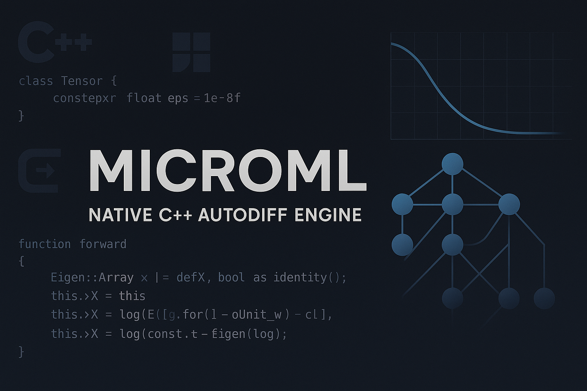
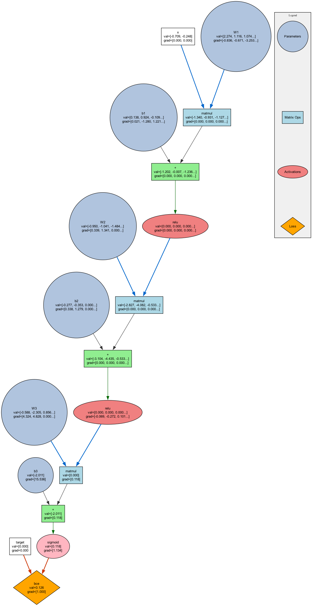

# MicroML  


MicroML is a lightweight neural network framework that demonstrates core deep learning concepts through clean C++ implementation. It features automatic differentiation with computational graphs, SIMD-optimized tensor operations, and gradient-based training algorithms - all with minimal dependencies. 

## Architecture & Design

```
            ┌────────────────────┐
            │    User Model      │
            │  (C++ Operator     │
            │   Overloads)       │
            └────────┬───────────┘
                     │
                     ▼
    ┌────────────────────────────────┐
    │ Computational Graph Builder    │
    │  • Topological Sort            │
    │  • Node & Edge Allocation      │
    │  • Memory-Efficient Strides    │
    └────────────────────────────────┘
                     │
    ┌────────────────▼────────────────┐
    │ Forward Pass Evaluator          │
    │  • Lazy Execution               │
    │  • SIMD-Accelerated Kernels     │
    └────────────────┬────────────────┘
                     │
    ┌────────────────▼────────────────┐
    │ Backward Pass Differentiator    │
    │  • Reverse-Mode Autodiff        │
    │  • Gradient Accumulation        │
    └────────────────┬────────────────┘
                     │
    ┌────────────────▼────────────────┐
    │ Optimizer & Parameter Updates   │
    │  • AdamW with Bias Correction   │
    │  • Weight Decay & Clipping      │
    │  • Momentum Accumulation        │
    └─────────────────────────────────┘
```

**Core Components:**
- **Value**: Computational graph node holding data, gradient, operation tag, and adjacency list
- **Tensor**: N-D array with shape, strides, and raw buffer enabling broadcast and matrix operations  
- **Graph**: Built dynamically on operator calls, finalized by fast topological sort for minimal overhead

## Core Features

### 🔄 Automatic Differentiation
- **Computational Graph Construction**: Dynamic graph building with topological sorting for proper gradient flow
- **Reverse-Mode Autodiff**: Efficient backpropagation through arbitrary computational graphs
- **Scalar & Tensor Operations**: Built-in ops include `+`, `-`, `*`, `/`, `pow`, `matmul`, `relu`, `sigmoid`
- **Graph Visualization**: DOT file generation with PNG export via Graphviz for educational demos

### 🧮 Tensor Operations
- **Broadcasting**: NumPy-style broadcasting for element-wise operations
- **SIMD-Accelerated MatMul**: `Tensor::matmul` leverages xsimd for AVX2/FMA speed on dense operations
- **Memory-Efficient Strides**: Cache-friendly memory access patterns and gradient shape fitting

### 🏗️ Neural Network Components
- **Value System**: Smart pointer-based computational nodes with automatic memory management
- **Loss Functions**: Cross-entropy (binary & multi-class) and MSE loss with proper gradients
- **Activation Functions**: ReLU and Sigmoid with correct derivative computation
- **MLP Architecture**: Configurable multi-layer perceptrons with Xavier initialization

### ⚡ Optimization & Training
- **AdamW Optimizer**: Adaptive learning rates with weight decay and bias correction
- **End-to-End Training**: Complete workflows for binary classification, multi-class CE, MSE regression
- **Gradient Accumulation**: Proper gradient handling and momentum across training batches

## Technical Implementation

### Computational Graph Engine
```cpp
// Values automatically track computational history
auto z = Value::add(Value::matmul(x, W), b);  // z = xW + b
ReLU relu(z);
auto activated = relu.forward();

// Backward pass through entire graph
loss->backward();  // Computes gradients for all parameters
```

### Tensor Broadcasting
```cpp
// Automatic shape compatibility
Tensor A = Tensor({1, 2, 3, 4}, {2, 2});        // (2, 2)
Tensor B = Tensor({10}, {1});                    // scalar
auto C = A + B;  // Broadcasting: (2, 2) + (1,) -> (2, 2)
```

### SIMD-Optimized Operations
Matrix multiplication uses vectorized instructions for performance:
```cpp
// Inner loop uses SIMD batches
for (k; k + simd_size <= m; k += simd_size) {
    batch x_simd = batch::load_unaligned(&x_data[i * m + k]);
    batch y_simd = batch::load_aligned(y_temp);
    sum += xs::reduce_add(x_simd * y_simd);
}
```

## Project Structure

```
microml/
├── src/
│   ├── tensor.{hpp,cpp}     # N-D tensor operations & broadcasting  
│   ├── prime.{hpp,cpp}      # Value system & automatic differentiation core
│   ├── loss.{hpp,cpp}       # Loss functions (CE, MSE) & activation functions
│   ├── nn.{hpp,cpp}         # Neural network architectures (MLP)
│   ├── optim.{hpp,cpp}      # Optimization algorithms (AdamW)
│   ├── main.cpp             # Training examples & loss function comparisons
│   └── test.cpp             # Development tests & validation
├── viz/                     # Generated computation graph visualizations
│   ├── ce_test.{dot,png}    # Cross-entropy loss computation graph
│   ├── mse_test.{dot,png}   # MSE loss computation graph  
│   ├── xor_ce_test.{dot,png}    # XOR training with CE loss
│   └── xor_mse_test.{dot,png}   # XOR training with MSE loss
├── xsimd/                   # SIMD acceleration library (submodule)
└── README.md
```

## Dependencies

- **xsimd**: SIMD-accelerated tensor operations (AVX2/FMA)
- **C++20**: Modern C++ features for clean memory management
- **Graphviz**: Optional, for computational graph visualization

## Examples & Results

The framework demonstrates learning on synthetic datasets:

### Binary Classification Tasks
- **Greater Than Gate**: 4-feature classification (sum comparison)
- **XOR Gate**: Non-linearly separable 2D problem

### Training Comparison
Cross-entropy vs MSE loss performance on the same architectures (600 and 800 Total Samples):

```
=== GREATER THAN GATE ===
Cross Entropy Accuracy: 98.0%
MSE Accuracy: 98.0%

=== XOR GATE ===  
Cross Entropy Accuracy: 100.0%
MSE Accuracy: 100.0%
```

### Gradient Visualization
The framework generates computation graph visualizations showing gradient flow through the network:

**Greater Than Loss Gradient Graph:**


**XOR Gate Loss Gradient Graph:**


These visualizations demonstrate the topological sort and automatic differentiation process, making the gradient flow transparent for educational purposes.

## Key Learning Outcomes

This was an incredibly fun project to build that got me deep into the weeds of C++ and creating a powerful API for ML:

- **Automatic Differentiation**: How computational graphs enable efficient gradient computation and can be optimized (via toposort)
- **Memory Management**: Smart pointer usage for graph nodes and gradient accumulation
- **Numerical Stability**: Handling edge cases in loss functions and activations  
- **Linear Algebra**: Matrix operations, broadcasting, and gradient shape management
- **Optimization Theory**: How adaptive learning rates and momentum work in practice
- **Software Architecture**: Designing modular, extensible ML components

## Build & Run

```bash
# Clone with xsimd submodule for SIMD operations
git clone --recursive https://github.com/your-username/microml.git
cd microml

# Build with optimizations
g++ -std=c++20 -O3 -march=native -mavx2 -mfma \
    -Ixsimd/include \
    src/*.cpp -o microml

# Run examples
./microml
```

## Performance Benchmarks

Training performance comparison between SIMD-optimized and naive matrix multiplication:
- **SIMD Vectorization**: Matrix operations leverage AVX2/FMA instructions
- **Cache-Friendly**: Memory strides optimized for sequential access patterns  
- **Lightweight**: Minimal dependency footprint suitable for embedded applications

### Training Configuration
- **Greater Than Gate**: 500 training samples, 100 test samples, 200 epochs
- **XOR Gate**: 600 training samples, 200 test samples, 300 epochs
- **Hardware**: Apple Silicon (M-series processor with ARM NEON)
- **Compiler**: Clang with `-O3 -march=native -mavx2 -mfma`

### Results

| Task | SIMD (ms) | Naive (ms) | Speedup |
|------|-----------|------------|---------|
| Greater Than Gate (CE) | 6,477 | 57,315 | **8.85x** |
| Greater Than Gate (MSE) | 6,347 | 56,979 | **8.98x** |
| XOR Gate (CE) | 9,863 | 82,504 | **8.36x** |
| XOR Gate (MSE) | 9,764 | 83,763 | **8.58x** |
| **Total Training** | **32,451** | **280,561** | **8.64x** |

### Key Insights
- **Consistent 8-9x speedup** across all training scenarios
- SIMD optimization provides dramatic performance gains for matrix-heavy operations
- Training time reduced from **4.7 minutes** to **32 seconds** - making experimentation much more interactive
- Performance scales well across different problem complexities (4-feature vs 2-feature datasets)

## Limitations & Future Work

**Current Limitations:**
- Single-threaded execution (except vectorized matmul)
- No operator fusion or kernel optimization
- Limited to dense layers
- Basic numeric stability handling

**Potential Extensions:**
- Operator fusion for fused kernels (MatMul + Add + ReLU)
- Thread pool for parallel operations
- Convolutional layers and common architectures
- Advanced optimizers and learning rate schedules
- Python bindings for rapid prototyping

## Inspiration

This project was inspired by:
- [micrograd](https://github.com/karpathy/micrograd) by Andrej Karpathy
- Understanding PyTorch's autograd system
- Implementing the math behind neural networks from scratch

## Contributing

This is primarily an educational project, but suggestions and improvements are welcome! The code prioritizes clarity and learning over performance.

---

*devpatelio* 🚀 
